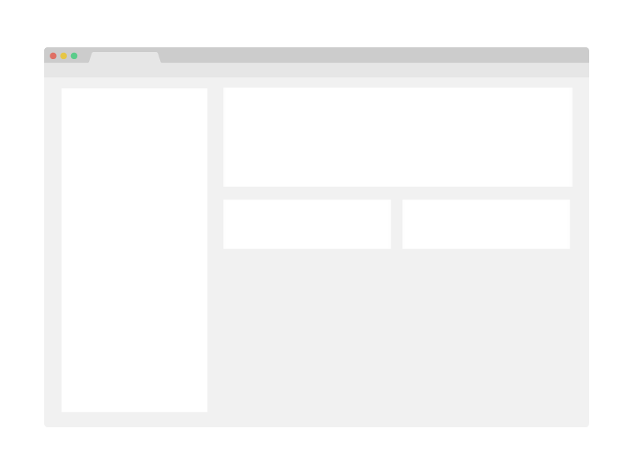

# Devsearch

> One paragraph statement about the project.

Additional description about the project and its features.

## Built With

- Python
- Html
- css

## Live Demo

[Live Demo Link](https://livedemo.com)

## Getting Started

**This is an example of how you may give instructions on setting up your project locally.**
**Modify this file to match your project, remove sections that don't apply. For example: delete the testing section if the currect project doesn't require testing.**

To get a local copy up and running follow these simple example steps.

### Prerequisites

### Setup

### Install

### Usage

### Run tests

### Deployment

## Authors

👤 **Kiprotich Kimutai**

- GitHub: [@Kimutai01](https://github.com/Kimutai01)
- LinkedIn: [LinkedIn](https://www.linkedin.com/m/in/kimutai-kiprotich-1b5045216)

## 🤝 Contributing

Contributions, issues, and feature requests are welcome!

Feel free to check the [issues page](../../issues/).

## Show your support

Give a ⭐️ if you like this project!

## Acknowledgments

- Denis Ivanov
-Django course

## 📝 License

This project is [MIT](./MIT.md) licensed.
